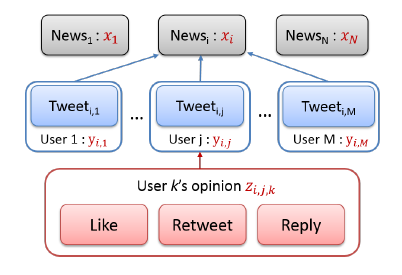
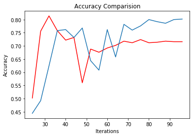

# Unsupervised Fake news detection

## Introduction
Social media has become one of the main channels for people
to access and consume news, due to the rapidness and low
cost of news dissemination on it. However, such properties of
social media also make it a hotbed of fake news dissemination,
bringing negative impacts on both individuals and society.
Therefore, detecting fake news has become a crucial
problem attracting tremendous research effort.   Most existing
methods of fake news detection are supervised, which require
an extensive amount of time and labor to build a reliably annotated
dataset. 
Here there is an implementation of an unsupervised fake news prediction algorithm which does not require a classified dataset. 
<b>Along with implementing the paper we have also suggested and implemented an improvement which increases the performance of the algorithm by around 8-10% depending on the dataset</b> 

## Model description

  

### News predicion
Suppose the set of news is denoted by N, and the sets of
verified and unverified users are denoted by M and K, respectively.
For each given news i in N, we collect all the
verified users’ tweets on this news. Let Mi  M denote
the set of verified users who published tweets for the news.
Then, for the tweet of each verified user j in Mi, we collect
the unverified users’ social engagements. Let Ki,j  K
denote the set of unverified users who engaged in the tweet.
For each given news i, we use a latent random variable
xi in {0,1} to denote its truth, i.e., fake news (xi = 0) or
true news (xi = 1). To infer whether a news piece is fake or
not, we need to extract the users’ opinions on the news from
their engagement behaviors.
### Verified user's opinion
For each verified user j in Mi, we let yi,j in {0,1} denote
the user’s opinion on the news, i.e., yi,j is 1 if the user thinks
the news is real and 0 otherwise.Let Newsi and Tweeti,j denote the
news content and the user j’s own text content of the tweet,
respectively. Then, yi,j can be defined as the sentiment of
Tweeti,j , or if the opinion of Tweeti,j is nonconflicting
to that of Newsi 
### Unverified user's opinion
For verified user j’s tweet on news i, many unverified
users may like, retweet, or reply to the tweet. Let zi,j,k in
{0,1} denote the opinion of the unverified user k in Ki,j .We
assume that if the user k liked or retweeted the tweet, then
it implies that k agreed to the opinion of the tweet. If the user
k replied to the tweet, then its opinion can be extracted by
sentiment analysis. It is common that
an unverified user may conduct multiple engagements in a
tweet (e.g., liked and also replied to the tweet). In this case,
the user’s opinion zi,j,k is obtained using majority voting.

## Improvement in algorithm
### First Improvement:
In the proposed algorithm the values of alpha which represents the distribution of verified users opinion are considered constant. 
In our improvised algorithm alpha changes with every iteration adjusting itself according to the verified user's true positive rate, by which we achieve the fact that alpha adjusts itself according to the verified user's credibility.

### Second Improvement
In the current algorithm, credebility of each particular verified user is not taken in use. The fact that each verified user is going to have a different credibility helps us in improving the calculation of counting the prediction by verified users on  a weighted basis. A user with a high credibility will now state a fact with a higher weight than a user with lower credibility.

## Results and comparision
<b>Comparing the accuracy of proposed algorithm and improvised algorithm</b>

  

